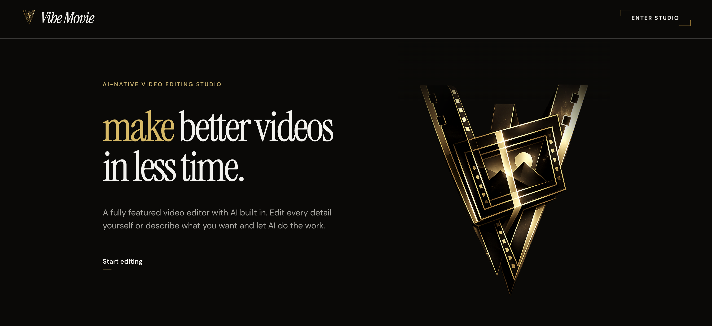
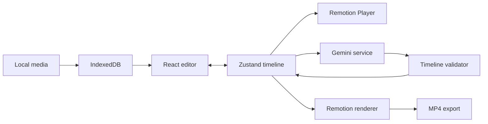

<p align="center">
  
</p>

# VibeMovie

**Make the movie, but easier.**

VibeMovie is an AI-assisted video editor that pairs a familiar, hands-on timeline with natural-language editing. Import footage, arrange and trim clips directly, or describe a change and let the AI reshape the same project state.

[Open VibeMovie](https://vibe-movie-six.vercel.app)

## Architecture

The visual editor and the AI operate on one typed timeline model. Manual edits update the Zustand project store; AI responses are validated and adapted into that same store, so there is no separate or opaque AI edit.



### Direct timeline editing

Dragging, trimming, splitting, snapping, track controls, keyboard actions, and clip menus all operate on the same project state. Imported media blobs live in IndexedDB while serializable metadata is persisted separately in local storage.

### Frame-accurate playback and export

Timeline seconds are normalized into Remotion frame positions at 30 fps. The browser uses `@remotion/player` for interactive preview; the Node service bundles the matching composition and renders an H.264 MP4. Export assets are uploaded into request-safe temporary storage and removed after delivery.

### Structured AI editing

The Express service sends Gemini the current timeline, available asset metadata, and the requested edit. Returned JSON is parsed at the API boundary, validated, normalized, and then loaded into the editor. Invalid model output is rejected instead of silently replacing the project.

## Tech stack

| Layer | Technology | Responsibility |
| --- | --- | --- |
| Web app | React 19, TypeScript, Vite | Landing page and editing workspace |
| Timeline | Zustand, `@dnd-kit` | Project state and direct manipulation |
| Local media | IndexedDB, localStorage | Persistent assets and editor metadata |
| Preview | Remotion Player | Frame-accurate in-browser playback |
| Rendering | Remotion Bundler and Renderer | Server-side MP4 composition |
| AI | Google Gemini | Natural-language timeline transformations |
| API | Node.js, Express, Multer | Chat, uploads, and export orchestration |
| Hosting | Vercel | Static Vite application and SPA routing |

## Repository layout

```text
frontend/   React editor, timeline, preview, and landing page
backend/    Gemini orchestration and Remotion rendering service
docs/       Repository artwork
```

The Vite development server proxies `/api` to the local Express service. Production keeps the frontend and rendering service independently deployable because server-side video rendering requires a browser runtime and temporary media access.

## Local development

```bash
npm --prefix frontend install
npm --prefix backend install
cp backend/.env.example backend/.env
npm run dev:api
npm run dev:web
```

AI editing uses a Gemini API key supplied in the editor. The key is kept for the current browser tab and sent only with AI requests; the editor remains usable without one.

## Quality checks

```bash
npm run check
npm run audit
```

Built and maintained by [Evan He](https://evanhe.co).
